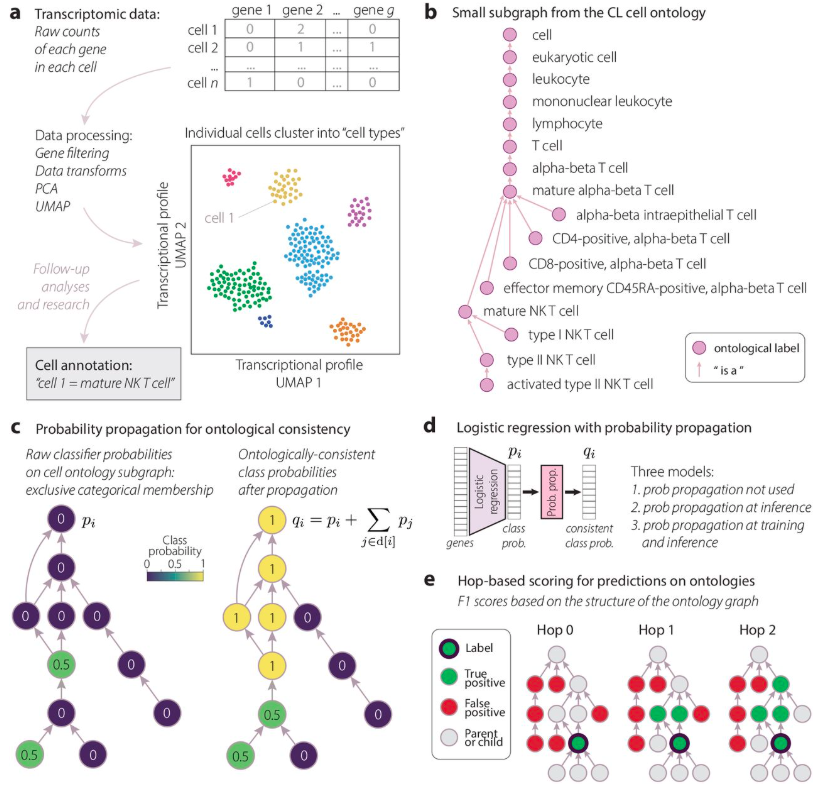
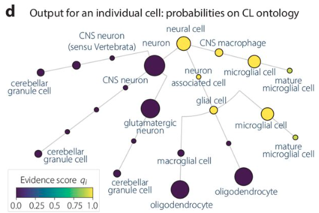

# A supervised ontology-aware cell annotation method (SOCAM) for single-cell transcriptomic data

Nimish Magre, Ebtisam Alshehri, Fedor Grab, Yerdos Ordabayev, Steven A. McCarroll, Mehrtash Babadi, Stephen J. Fleming

https://www.biorxiv.org/content/10.64898/2026.01.13.699356v1

An implementation in the cellarium-ml library



## Overview

Current cell type annotation methods often overlook the hierarchical structure of cell types defined in the Cell Ontology. This can lead to inconsistent probabilistic outputs and suboptimal benchmarking. In this work, we address these limitations by introducing:

- **Hierarchical Probability Propagation**: A strategy that ensures predictions are consistent with ontological parent-child relationships.
- **Ontology-Aware Evaluation**: A novel *hop-based F1 scoring* scheme that rewards predictions based on their semantic proximity in the ontology graph.
- **Lightweight Logistic Regression Model**: A scalable model that integrates ontological constraints into a fast, interpretable classification pipeline.

These additions emphasize *annotation over rigid classification* and improve biological interpretability.

We show that:

- The proposed method **improves hierarchical consistency** of predicted probabilities.
- An **ontology-aware benchmarking metric**, the hop-based F1 score correlates better with expert annotation consensus than traditional F1 metrics.
- The model is **scalable** to millions of cells and thousands of labels.

## Example output

Output can take the form of evidence scores on the full Cell Ontology graph for each cell, as shown here



or the result can be distilled to a single "best label" per cell.

## Example usage

We have an example of a Jupyter notebook that can be used to add cell type labels (from the Cell Ontology) to a new dataset:

[Quickstart tutorial notebook](notebooks/SOCAM_quickstart_tutorial.ipynb)

This SOCAM model will soon be released as a model in [Cellarium's Cell Annotation Service](https://cellarium.ai/tool/cellarium-cell-annotation-service-cas/), allowing users to annotate cells quickly and easily using a cloud service with a python API.

## `cellarium-ml` installation and model training

To install the package:

```bash
git clone --single-branch --branch SOCAM https://github.com/cellarium-ai/cellarium-ml.git
cd cellarium-ml
make install
```

To train the logistic regression model with hierarchical constraints:

Training:
```bash
custom_logistic_regression --fit --config SOCAM_train_base_model_config.yaml
```
Inference:
```bash
custom_logistic_regression --predict --config SOCAM_test_base_model_config.yaml
```

Trained model weights:

Publicly accessible here

```
gs://cellarium-public/socam/socam_model.ckpt
```
